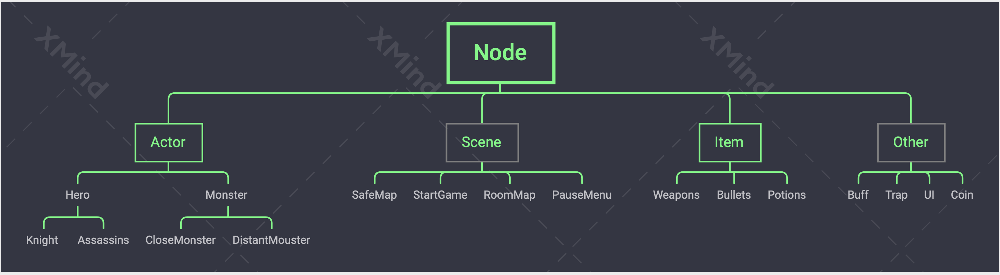
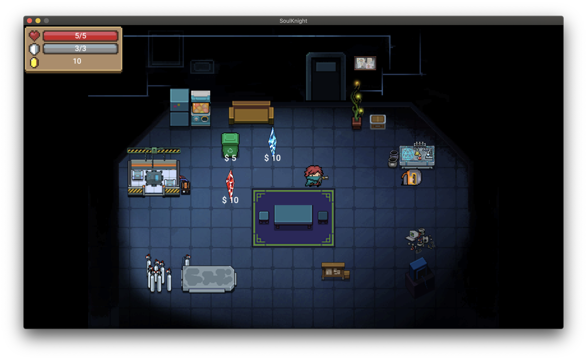
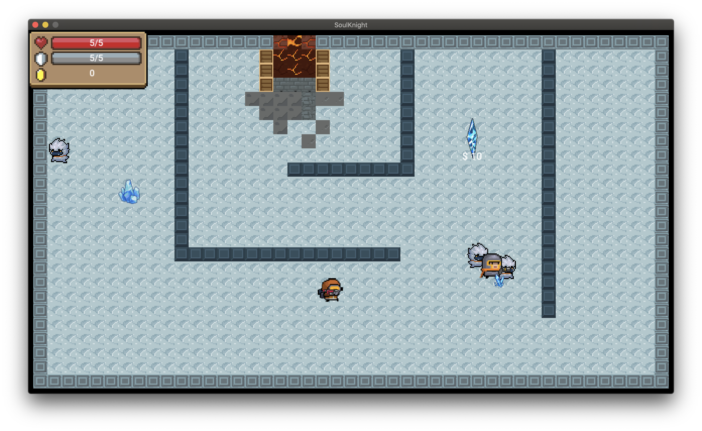
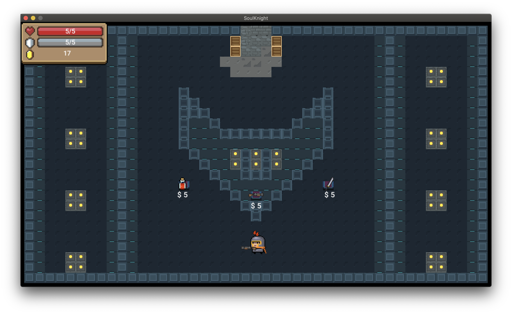
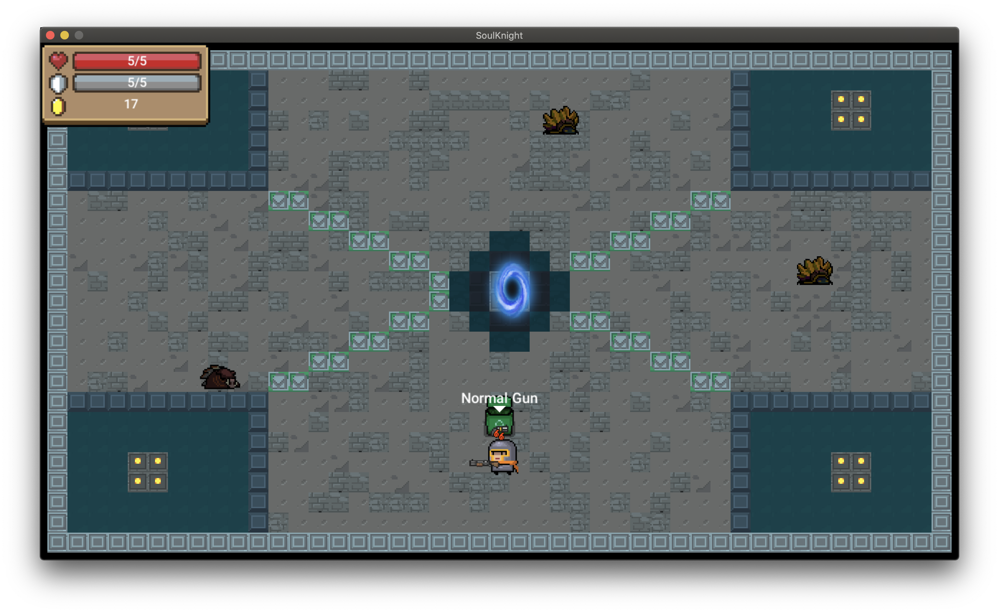

# 项目信息
## 项目名
**加把劲骑士 (Ganbatte Knight)**
 （来自选题“元气骑士 ©CHILLYROOM”）

## 项目成员 & 贡献比
|姓名 | 学号 | 贡献比 以平均值为100% | 贡献比 以总分为100% | 班级 |
| --- | --- | :-----: | :----: | :---: |
| 卓正一 | 1850384 | 100% | 25% | 朱老师 |
| 肖　杨 | 1950430 | 100% | 25% | 赵老师 |
| 李嘉树 | 1952101 | 100% | 25% | 朱老师 |
| 翟晨昊 | 1952216 | 100% | 25% | 赵老师 |

## 项目地址
[PlusOneZ/Course project of Tongji SSE OOP course 2020](https://github.com/PlusOneZ/OOPCourseProject)

## 进度时间线
| 日期 | 功能 | 
| :---:  | ---- |
| 5.07	| 项目创建  |
| 5.15	| [类基本设计](otherFiles/ClassDesign.md) 
| 5.22	| 正式第一周计划、[代码风格](otherFiles/CodingStyle.md)
| 5.23	| 安全屋场景实现
| 5.24	| 暂停目录功能实现
| 5.25 | 安全屋现在有了可以显示的英雄 同时英雄有了一些基本的动画动作
| 5.28	| 更新了第一次的控制器 可以操控移动 并且增加了接口
| 5.29	| 移动动画实现 动画功能基本完成改用新的控制器 使用cocos的接口
| 5.30	| 实现了子弹层、子弹类、武器类
| 5.31	| 具体房间地图的雏形实现
| 6.1	| 使用物理引擎
| 6.4	| 实现了一些障碍物、边界、门的初始化
| 6.6	| 实现了第一个能够实体化的道具血瓶
| 6.7	| 添加了霰弹枪以及近战武器，新增了怪物类
| 6.8	| 实现了第一个远程怪物
| 6.9	| 实现了靠近道具、武器时的信息显示 实现了拥有技能的刺客英雄 实现了子弹命中的功能 在安全屋添加了用于测试的怪物
| 6.11	| 修改了[碰撞掩码](otherFiles/BitMask.xlsx)，使其统一，从而方便碰撞监测 实现了buff类的基本内容 实现了商店物品的基本函数与金币功能
| 6.12	| 添加了陷阱类 实现了交换手中与地面的武器
| 6.13	| 远程怪物拥有了射击功能 完善了陷阱类 追加了骑士英雄和buff类的功能
| 6.14	| 实现了显示英雄当前血量、护甲、金币的ui 新增了游戏房间的地图及瓦片地图
| 6.15	| 为绝大多数物品加入了音效 添加了信息板，用于在安全地图查看信息 实现了雕像类，可以添加永久持续的buff 怪物现在可以被击杀
| 6.16	| 更新了新的远程怪物
| 6.17	| 添加了宝箱 能够随机开出物品
| 6.18	| 在安全屋可以切换英雄了
| 6.19	| 实现了近战怪物 为安全屋增加了前往游戏地图的门
| 6.20	| 新增了护甲药水
| 6.21	| 更新了商店地图 更新了通关后的门 更新了金币掉落 新增了三种秘籍 现在随机生成不同种类的怪物
| 每天	| 修复各种bug以及写新的bug

# 项目开发

## 注意事项
在 Windows 版本下的野猪在近距离击杀时会出现奔溃现象，这个现象在 Mac 版本下并没有发现。这关于物理引擎“关节 (joint) ”的 bug 难以修复，所以在 win-release 版本中并没有生成野猪怪。这是 win-release 和 mac-release 的唯一不同之处，可以在 mac 版本中体验野猪怪，源码都包含了这个野猪怪。

## 1. 架构设计

### 基类
+ Actor
+ Item
+ Weapon
+ Bullet

具体类在代码中体现，一般一个文件 (.h + .cpp) 就是一个类。

## 2.分工

| 组员 | 完成项 |
| --- |  :---: |
| 卓正一 | 美工、暂停目录及音乐控制、怪物和怪物武器、子弹 |
| 肖　杨 | 英雄、技能、Buff & debuff、道具及其他拾取物、购买系统 |
| 李嘉树 | 地图、怪物生成和场景切换相关 |
| 翟晨昊 | 英雄武器装备、子弹、安全地图和公告板 |

## 难点及解决
1. cocos 的内存管理机制。由于 cocos 的类似 GC 机制，很多指针必须先调用 retain() 才能在函数外使用。初期以及中期由于这个问题产生了很多 bug。初期以及中期由于不清楚这个问题产生了很多 bug ，最终通过逐步 debug 寻找调用堆栈确认了问题出在指针为空，通过查阅 cocos 官方 API 和文档找到了使用retain的方法。
2. 物理引擎的使用。通过物理引擎的使用优化了性能，但是同时增加了物理引擎的
学习时间，从碰撞体积到节点的实现以及碰撞的初次实现都花费了很久。主要问题在于学习成本以及对物理引擎函数不熟悉，最终找到了几个关键函数实现了不同情况的碰撞时间。
3. 碰撞监听问题。由于通过tag来判断发生碰撞的物品，经常会因为 tag 相同/不同而产生问题。同时研究碰撞掩码也比较耗时。我们通过列表格的方式决定各类物体之间是否刚体碰撞、是否有碰撞事件，写出了最终的掩码表。
4. 在场景上动态添加、释放节点，以动作序列来完成角色和怪物的攻击、死亡需要注意的方面也很多。

## 踩坑
1. 没有 retain 和手动消除引用，英雄加不进下一个场景。
2. 节点的位置是相对父节点的，用全局的坐标是不行的，需要换算或用 convertToWorld。
3. 瓦片地图使用图片集生成不能再 cocos 当中正常使用，要使用一张图片进行裁切。

## 亮点
1. 每一个物体与物体之间的判断都是依靠物理引擎来实现的，不同物体与英雄的碰撞响应不同。
2. 与原来游戏不同的是，我们的游戏采用了固定地图、过房间的方式。（我们以为实现起来会更简单，其实并不会）
3. 地图上的怪物生成有几种不同的搭配，每个房间遇到什么样的怪是随机的。
4. 怪物的 AI 通过简单的方式实现，但效果不错。近战和远程有不同的攻击方式，两种近战怪的攻击逻辑也不同。
5. 新增了秘籍（作弊码）的实现，让手残的我也能轻易通关。
6. 用了一个 Const.h 管理全部的常量，在代码中尽量不使用裸值。

## 基本项
已全部完成

## 加分项
+ 随机道具、敌人（Roguelike!)
+ 两名主角 Knight / Assassin，各自技能、属性不同
+ buff / debuff，由雕塑、陷阱实现
+ 金币，击杀怪物会掉落
+ 商店系统，在安全屋和游戏地图中都有
+ 地形机关（陷阱）
+ 一个 Boss
+ 秘籍！(欢迎尝试 become zch / become ljs)

## 截图

## C++11 特性
* [初始化列表](../Classes/Scene/RoomMap.h)
* [lamda 表达式](../Classes/Scene/PauseMenu.cpp)
* [类型推断（auto）](../Classes/Scene/SafeMap.cpp)
* [范围 for 循环](../Classes/Actor/Monster.cpp)

=======
## 操纵
| 键 | 动作 |
| --- | --- |
| 游戏中：|
| 鼠标左键单击           |      射击|
| WASD键        |               移动|
| F键             |                  交互物品|
| SPACE键       |              人物技能|
| E键                |              切换武器|
| ESC键              |            菜单栏|
| 信息板中：
| AD键                 |           左右切换|
| Z键                  |             退出  |

